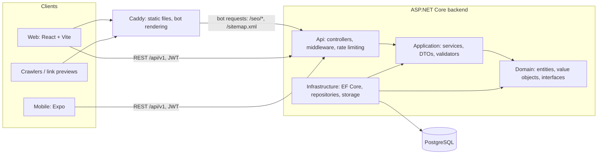

# Family Shop

Full-cycle e-commerce store for the Kazakhstan market (clothing, footwear, bags, home appliances, sports goods, tableware, accessories). In production, with a web storefront, an admin panel, a REST API and a mobile app.

**Live site: https://www.familyshop10.kz**


## Screenshots

| Home | Catalog |
|---|---|
|  |  |

| Product | Mobile |
|---|---|
|  |  |

## Tech stack

| Area | Technology |
|---|---|
| Backend | .NET 10, ASP.NET Core, EF Core 10 (Npgsql), FluentValidation, BCrypt.Net, JWT Bearer, ClosedXML (Excel export), Swagger (Development only) |
| Database | PostgreSQL 16, EF Core migrations (additive and idempotent), ASP.NET Data Protection keys stored in the database |
| Frontend | React 19, TypeScript 6, Vite 8, React Router 7, i18next (ru / kk / en), plain CSS with design tokens, light and dark themes |
| Mobile | Expo (React Native 0.86), React Navigation, expo-secure-store, i18next |
| Testing | xUnit (backend), Vitest + Testing Library (frontend), Jest + jest-expo (mobile) |
| Deployment | Railway (API in Docker, site built with Railpack and served by Caddy, Railway Volume for uploaded images), GitHub Actions (tests, dependency audit) |

## Architecture

The backend follows Clean Architecture. Dependencies point inward only; `Domain` has no references to EF Core or ASP.NET.



Key patterns:

- **`Result<T>`** instead of exceptions for expected business failures (for example "not enough stock"); controllers map the result code to an HTTP status (409, 422, ...).
- **Repository + Unit of Work** (`IUnitOfWork`, `RepositoryBase<T>`): services depend on interfaces from `Domain`; `ExecuteInTransactionAsync` wraps multi-step operations.
- **Value Objects**: `Money` and `Email` validate and encapsulate their invariants.
- **FluentValidation** for every input DTO, including list filters (page size limits, sort fields).
- **Atomic stock handling**: conditional `UPDATE ... WHERE Stock >= @q` inside a transaction, deterministic lock order, compare-and-set order status transitions. Covered by integration tests against a real PostgreSQL.
- **Idempotent order creation** via the `Idempotency-Key` header (the key is claimed inside the order transaction, so a double click or a retry cannot create two orders).
- **Idempotent seeding**: upsert by a stable key; repeated startups never create duplicates or break links to existing orders and reviews.

## Key features

Storefront (web and mobile)

- Catalog with categories, gender sections, product types, size, price range, search and sorting; pagination
- Per-product available sizes with size grids by product type (clothing, adult shoes, kids shoes)
- Product page with gallery, reviews and ratings, quick view, recently viewed, favorites
- Cart keyed by product and size, with stock-aware quantity limits; promo codes
- Checkout and order history; cancelling an order returns its stock
- Three languages (Russian, Kazakh, English), light and dark themes, skeleton loading, responsive layout
- Account management, session list with per-device revocation, account deletion

Admin panel

- Products (images upload, sizes, types), categories, promo banners, promo codes
- Orders with status workflow and dashboard statistics computed in the store time zone
- Finance module: payment ledger, manual expenses (soft delete), balance and charts, Excel export

SEO

- Dynamic meta tags, canonical URLs, Open Graph / Twitter tags
- Server-rendered HTML with JSON-LD for products and categories (`/seo/product/{id}`, `/seo/category/{slug}`), served to link-preview bots (WhatsApp, Telegram, Facebook, Twitter, Slack, LinkedIn, Yandex) by the Caddy front
- Generated `sitemap.xml` with products and categories, `robots.txt`, `noindex` on private pages

Mobile app (Expo)

- Catalog, search, product, favorites, cart, checkout, orders, profile, device management
- Separate token flow with device binding; refresh token kept in the platform secure store

## Security

- Passwords hashed with **BCrypt** (work factor 12); server-side password policy (letters and digits, common-password list, bcrypt 72-byte limit); login responses and timing do not reveal whether an email exists
- **JWT access tokens** (HS256, 15 minutes) bound to a session family; **refresh tokens with rotation** in an `httpOnly`, `Secure` cookie for the web (token never appears in a response body), reuse detection revokes the whole session family; access tokens stop working immediately after logout or revocation
- Mobile flow: refresh token in the JSON body, stored in Keychain/Keystore, bound to a device identifier
- **CSRF** protection for cookie endpoints (custom header and Origin check)
- **Rate limiting** per IP with separate policies for login, registration, refresh, order creation, reviews and promo-code checks
- **CORS whitelist** (invalid origins fail startup), `AllowedHosts` restriction
- **HSTS**, `X-Content-Type-Options`, `X-Frame-Options`, CSP and Referrer-Policy headers; `no-store` on auth responses
- Authorization is closed by default (`FallbackPolicy`); a reflection test pins the list of anonymous endpoints and the admin role on `/admin/*`
- Upload validation by file signature (JPEG, PNG, WEBP, GIF only), random file names
- **Secrets stay out of the repository**: user-secrets locally, environment variables in production; the API refuses to start outside Development with a placeholder JWT key
- **Pre-commit hook** (`.githooks/pre-commit`) blocks commits containing passwords, keys, tokens, connection strings or private keys; the hook itself has a test script (`.githooks/test-pre-commit.sh`)
- CI runs `npm audit` and a vulnerable-package check for NuGet dependencies on every push and weekly

## Testing

All suites were run on 2026-10-10:

| Suite | Result |
|---|---|
| Backend (`dotnet test`, xUnit) | 682 passed, 0 failed, 0 skipped |
| Frontend (`vitest`) | 520 passed in 56 files |
| Mobile (`jest`) | 271 passed, 4 skipped (30 of 31 suites run) |
| **Total** | **1473 passed, 0 failed** |

What is covered:

- Backend: application services, FluentValidation rules, password and token policies, authorization of every endpoint (reflection test), SEO rendering and XSS escaping, finance and money rules, size rules, time-zone boundaries, and integration tests on a real PostgreSQL (stock concurrency, idempotency keys, seeding, migrations). Integration tests create a temporary database and are skipped when PostgreSQL is not available.
- Frontend: pages (home, catalog, product, checkout, admin pages), cart, favorites and auth contexts, header behaviour, i18n key parity, SEO hooks.
- Mobile: screens, auth and session handling, cart logic, validation, catalog sorting and size states.

Type checking: `tsc -b` (frontend) and `tsc --noEmit` (mobile). The backend builds with 0 errors and 0 warnings.

## Getting started

Requirements: .NET 10 SDK, Node.js 22+, PostgreSQL 16.

```bash
git clone https://github.com/Dodikhudoev-Ahmad/Family_Shop.git
cd Family_Shop
git config core.hooksPath .githooks     # enable the secret-leak pre-commit hook
```

**Backend**

```bash
cd backend/Api
dotnet user-secrets set "ConnectionStrings:DefaultConnection" "Host=localhost;Port=5432;Database=familyshop;Username=postgres;Password=CHANGE_ME"
dotnet user-secrets set "Jwt:SecretKey" "CHANGE_ME_generate_a_random_string_of_at_least_32_characters"
dotnet user-secrets set "Seed:AdminPassword" "CHANGE_ME"
dotnet ef database update --project ../Infrastructure --startup-project .   # or let the app apply migrations on startup
dotnet run
```

`appsettings.json` contains only placeholders (`CHANGE_ME`); real values go to user-secrets or environment variables. Swagger is available in Development.

**Frontend**

```bash
cd frontend
cp .env.example .env.local     # set VITE_API_URL to the local API address
npm install
npm run dev
```

**Mobile**

```bash
cd mobile
cp .env.example .env.local     # set EXPO_PUBLIC_API_URL
npm install
npx expo start
```

**Checks before a commit**

```bash
cd backend && dotnet build FamilyShop.slnx && dotnet test FamilyShop.slnx --no-build
cd frontend && npx tsc -b && npm run test
cd mobile && npx tsc --noEmit && npx jest
```

## Project structure

```
backend/
  Domain/            entities, value objects, repository interfaces
  Application/       services, DTOs, validators, Result<T>
  Infrastructure/    EF Core context, migrations, repositories, storage, security
  Api/               controllers, middleware, rate limiting, SEO rendering
  Application.Tests/ unit and integration tests
frontend/            React + Vite storefront and admin panel, Caddyfile
mobile/              Expo (React Native) app
docs/                API, database, roles, state machines, money rules, SEO, deployment, design
.githooks/           pre-commit secret scanner and its tests
.github/workflows/   CI: tests and dependency audit
```

Further documentation lives in [docs/](docs/): [API](docs/Api.md), [Database](docs/Database.md), [Roles and sessions](docs/Roles.md), [Money and finance](docs/Money.md), [State machines](docs/StateMachines.md), [SEO](docs/Seo.md), [Deployment](docs/Deploy.md), [Design](docs/Design.md).
